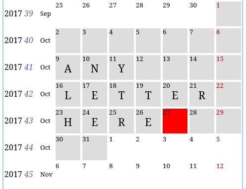

# nurse-shift-scheduler

## Overview

Quickly enter any single-letter code for each day. For example, `N`
for night-shifts and `D` for day-shifts.

You can enter letters into a calendar:



If you press a key, that'll be the single-letter code for that
day. Easily navigate using the arrow keys. Or click on a day to move
the red cursor there. You can then export to this:

```
BEGIN:VCALENDAR
VERSION:2.0
PRODID:-//ingurnus

BEGIN:VEVENT
UID:20171023@ingurnus
DTSTART;VALUE=DATE:20171023
SUMMARY:H
END:VEVENT

BEGIN:VEVENT
UID:20171024@ingurnus
DTSTART;VALUE=DATE:20171024
SUMMARY:E
END:VEVENT

BEGIN:VEVENT
UID:20171025@ingurnus
DTSTART;VALUE=DATE:20171025
SUMMARY:R
END:VEVENT

BEGIN:VEVENT
UID:20171026@ingurnus
DTSTART;VALUE=DATE:20171026
SUMMARY:E
END:VEVENT

...
...
...
...

END:VCALENDAR
```

## Setup

To get an interactive development environment run:

    lein figwheel

and open your browser at [localhost:3449](http://localhost:3449/).
This will auto compile and send all changes to the browser without the
need to reload. After the compilation process is complete, you will
get a Browser Connected REPL. An easy way to try it is:

    (js/alert "Am I connected?")

and you should see an alert in the browser window.

To clean all compiled files:

    lein clean

To create a production build run:

    lein do clean, cljsbuild once min

And open your browser in `resources/public/index.html`. You will not
get live reloading, nor a REPL. 

## License

Copyright © 2017 Kristian Lein-Mathisen

I release this to the Public Domain. No warranty or any of that, of
course.
